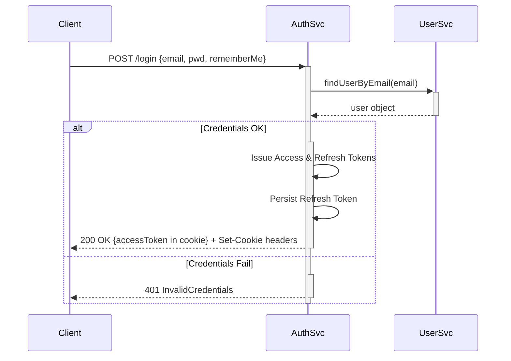
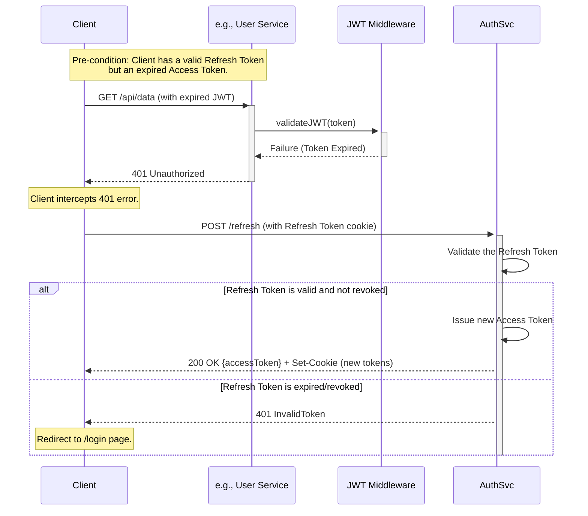

Software Requirements Specification
Microservice: Authentication Service

Version
0.3

Date
July 20, 2025

Author(s)
Ahmad Naji

Approved By
Not yet approved

# 1. Introduction

   1.1 Purpose
   This Software Requirements Specification (SRS) outlines the functional requirements for the Authentication microservice, derived from user stories. It serves as a reference for us developers and any new team members to ensure alignment on the microservice’s functionality.
   1.2 Scope
   The Authentication Service microservice handles user authentication,
   authorization, and session management for a system. It provides features like user login, logout, token generation,
   CAPTCHA verification, role-based access, login attempt tracking, password reset, user locking, and persistent login. It interacts with a user database and potentially other microservices (e.g., for user data or notifications). This SRS focuses solely on functional requirements based on user stories.

# 2. Functional Requirements

# 2.1 FR-1: User Login

User Story: US-1
Description: Authenticate users via email and password.
Input: Email, password, optional "remember me" flag.
Output: JWT token or error message.
## 1. Detailed Functional Requirements

Input DTO

```DTO
LoginRequest {
  email: string
  password: string
  rememberMe: boolean = false
  captchaResponse?: string
}
```

Pseudo Code for Login Process:

```pseudo
1. validateSchema(LoginRequest)
2. user = UserService.findUserByEmail(email)
3. if user == null → throw InvalidCredentials
4. if user.locked → throw AccountLocked
5. if needsCaptcha(user.failedAttempts) and !Captcha.verify(captchaResponse)
        → throw CaptchaFailed
6. if !PasswordEncoder.matches(password, user.passwordHash)
   6a. UserService.incrementFailedAttempts(user.id)
   6b. throw InvalidCredentials
7. UserService.resetFailedAttempts(user.id)
8. session = SessionManager.createSession(user.id, rememberMe)
9. cookies = CookieFactory.build(session)
10. return 200 { cookies, accessToken: session.accessToken.jwt }
```




Cookies
• access-token : Path=/; HttpOnly; Secure; Max-Age=15m
• refresh-token : Path=/refresh; HttpOnly; Secure; Max-Age=rememberMe ? 30d : 0 (session cookie)

#  2.2 FR-2: Logout

User Story: US-2
Description: Terminate user session.
Input: JWT token
Output: Confirmation or error message


A user-initiated action to terminate the current session and invalidate the refresh token.

- **Trigger**: A `POST` request to the `/logout` endpoint, authenticated by the `refresh-token` cookie.
    
- **Algorithm**:
 1- The **Auth Service** reads the `refresh-token` from the request's cookie header.
 2- The **Auth Service** will just return a header with these values :  
 `Set-Cookie: access-token=; HttpOnly; Max-Age=0;`
`Set-Cookie: refresh-token=; HttpOnly; Max-Age=0;`
3- Then the client will try to send a POST to /refresh to get an access token.
Since cookies are cleared, no refresh token is present.
4- **Auth Service** will return HTTP 404 Not Found and the front end will redirect the user to the /login endpoint.
# 2.3 FR-3: JWT Token Generation

User Story: US-3
Description: Generate JWT token on successful login.
Input: Valid credentials (email, password)
Output: JWT token
Acceptance Criteria:

 Upon successful authentication, the **Auth Service** gathers user details (ID, email, role) from the **User Service**.
 It retrieves the access token's time-to-live (TTL) from the **Settings Service** (e.g., `accessTokenTtlSeconds`).

```
JwtPayload payload = {
  sub: userId,
  email: user.email,
  role: user.role,
  iat: now(),
  exp: now() + TokenTtl.fromSettings("access")
}
accessToken = TokenIssuer.sign(payload)
```
# 2.4 FR-4: CAPTCHA Verification

User Story: US-4
Description: Require CAPTCHA after 3 failed login attempts.
Input: CAPTCHA response
Output: Verification result

A security mechanism to prevent automated brute-force attacks during login.

- **Policy**: A CAPTCHA challenge is required after a set number of consecutive failed login attempts. This threshold is managed in the **Settings Service**.
    
    - **Rule**: `needsCaptcha(failedAttempts) = failedAttempts >= 3`
        
- **Flow**:
    
    1. During the login process (**FR-1**), if the user lookup is successful but password validation fails, the **Auth Service** increments the failed attempt count via the **User Service**.
        
    2. If the new count meets or exceeds the `captchaThreshold`, subsequent login attempts from the client must include a `captchaResponse` in the `LoginRequest`.
        
    3. If the `captchaResponse` is missing or invalid, the **Auth Service** will increments the failed attempt count via the **User Service** until it reaches the maximum number of attempts.
    4. If the captchaResponse is present, the Auth Service verifies it using an external CAPTCHA provider (e.g., Google reCAPTCHA or hCaptcha):
    * Sends the token (captchaResponse) and secret key to the CAPTCHA verification API.
    * If the CAPTCHA is valid, the flow continues to password verification as normal.
    * If the CAPTCHA is invalid, the attempt is rejected with a 403 Forbidden or 400 Bad Request response, and the failure is logged via the Logging Middleware.
    5. If the user exceeds the **maximum number of failed login attempts** (e.g., 10), the **User Service**:
    - Locks the account by updating the user’s state to `"locked"`.
    - Logs the lockout event with IP, request ID, and timestamp.
    - Triggers a **notification to the user and administrator** (e.g., via email or internal alerting system).
    6. The client receives a specific error response:
    * If CAPTCHA is missing or invalid: "CAPTCHA validation failed" or "CAPTCHA required"
    * If the account is locked: "Account temporarily locked due to multiple failed attempts, check your email or contact the admin on admin@madar.com".
    7. Upon successful CAPTCHA and password validation:
     * The Auth Service resets the failed attempt counter using UserService.updateUserProfile(...).
     * Proceeds to normal login flow: issues tokens, sets cookies, etc.
# 2.5 FR-5: Role-Based Access

Note : Moved to the User service
User Story: US-5
Description: Assign and verify user roles for access control.
Input: User ID, role assignment
Output: Updated role or error message

 The **Auth Service**'s role is to embed the necessary claims into the JWT.

- **Auth Service Responsibility**: Include the user's `role` (e.g., "user", "admin") as a claim within the JWT payload.
    
- **Resource Server Responsibility**: Any service (e.g., User Service, Product Service) secures its endpoints by using a JWT validation middleware provided by the **Common Library**. This middleware inspects the `role` claim from the validated token and denies access if the role is not in the endpoint's list of required roles, returning a `403 Forbidden` error.

# 2.7 FR-6: Password Reset

On every reset password attempt the notification service will send an email with a link that have a random token ( Not JWT) that is saved in the database.

User Story: US-6
Description: Allow password reset via email.
Input: Email, new password, reset token
Output: Confirmation or error message

A multi-step flow allowing users to securely reset their password if they have forgotten it.

- **Step 1: Request Password Reset**
    
    1. The user submits their email via a `POST` to `/resetpassword/request`.
        
    2. The **Auth Service** calls the **User Service** to verify the email exists.
        
    3. The **User Service** generates a secure, single-use password reset token (e.g., a UUID with a 24-hour TTL) and stores its hash against the user's record.
        
    4. The **User Service** then publishes a `PasswordResetRequested` event containing the user's email and the plaintext reset token.
        
    5. The **Notification Service**, which subscribes to this event, sends an email to the user containing a link with the token (e.g., `https://app.com/reset-password?token=...`).
        
    6. The **Auth Service** returns a `202 Accepted` to the client.
        
- **Step 2: Submit New Password**
    
    1. The user clicks the link and submits a form with the token and their new password via a `POST` to `/resetpassword/submit`.
        
    2. The **Auth Service** receives the request and calls the **User Service** to validate the reset token.
        
    3. The **User Service** finds the token, verifies it's not expired or used, updates the user's password hash, and remove the reset token.
        
    4. The **Auth Service** returns a `204 No Content` on success.
# 2.8 FR-7: Persistent Login

User Story: US-7, US-10, US-11
Description: Enable persistent login across sessions.
Input: "Stay logged in" selection, JWT/refresh token
Output: Long-lived token or error message.

Defines the behavior for long-lived user sessions.

- **Behavior**:
    
    - If `rememberMe` is **false** at login, the `refresh-token` cookie is created without a `Max-Age`, making it a session cookie that is deleted when the browser is closed.
        
    - If `rememberMe` is **true**, the `refresh-token` cookie is created with a `Max-Age` of 30 days (value sourced from the **Settings Service**).
        
- **Sliding Window Renewal**: When a client with a "remember me" token successfully uses it at the `/refresh` endpoint, the **Auth Service** issues a brand new `refresh-token` with a freshly reset 30-day expiry. This new token replaces the old one, effectively extending the user's session as long as they remain active.
# 2.9 FR-8: Lock User Account

User Story: US-9
Description: Lock account after 10 failed login attempts.
Input: User ID, failed attempt count.
Output: Lock status or error message.

A protective measure to temporarily disable an account after too many failed login attempts.

- **Policy**: An account is locked after a set number of failed attempts (e.g., 10), with the threshold defined in the **Settings Service**.
    
- **Flow**:
    
    1. Following a failed login attempt, the **Auth Service** calls the **User Service** to increment the failure count.
        
    2. The `LoginPolicy` within the **Auth Service** checks if this new count has reached the `maxLoginAttempts` threshold.
        
    3. If the threshold is reached, the **Auth Service** calls a dedicated endpoint on the **User Service** (e.g., `POST /users/{id}/lock`).
        
    4. The **User Service** sets the `user.locked` flag to `true` and save it to the database and emits an `AccountLocked` domain event.
        
- **Unlocking**: The account can be unlocked by clicking a link received by email after the lock has happened, by an administrator email (**FR-10**).
# 2.10 FR-9: Account Lock Notification

User Story: US-9
Description: Notify user of account lock.
Input: User ID, email, lock event
Output: Email notification.

An event-driven notification to inform the user that their account has been locked.

- **Flow**:
    
    1. The **User Service**, after locking an account (**FR-9**), publishes the `AccountLocked` event. The event payload includes the `userId` and `email`.
        
    2. The **Notification Service** is subscribed to this event ( using a Kafka topic).
        
    3. Upon receiving the event, the **Notification Service** sends a pre-defined email template to the user, informing them of the lock and providing a secure link for unlocking their account.
# 2.11 FR-10: Service-to-Service Authentication

Notes: it will use service client internally.
User Story: US-10

Description: Enable secure service-to-service authentication.
Input: System-level access token, request metadata (requestID)
Output: Validated JWT or error message

Provides a secure authentication method for backend services. To maintain consistency across the platform, this flow reuses the primary user login mechanism. In this model, each trusted backend service is provisioned as a special type of user account.

- **Endpoint**: `POST /login` (The same endpoint used for human user login)
    
- **Input DTO**: `LoginRequest` (The same DTO used in **FR-1**)
    
    ```
    LoginRequest {
      email: string       // The service's unique identifier (e.g., "report-generator@service.local")
      password: string    // The service's secret credential
      rememberMe: boolean // Should be false for services
    }
    ```
    
- **Algorithm**:
    
    1. A backend service initiates a request to the `POST /login` endpoint with its assigned credentials.
        
    2. The **Auth Service** validates the request payload.
        
    3. It calls the **User Service** to find the account associated with the provided `email`. The **User Service** stores service accounts as regular user records, but with their `role` attribute set to **`SERVICE`**.
        
    4. The password is validated using the same hashing and comparison logic as for a human user.
        
        - Security policies like account locking (**FR-9**) still apply to service accounts.
            
        - CAPTCHA verification (**FR-4**) is explicitly bypassed for any account with the `SERVICE` role.
            
    5. Upon successful authentication, the **Auth Service** generates a JWT access token via the `TokenIssuerService`.
        
    6. The payload of the JWT is constructed with the `role` claim set to **`SERVICE`**.
        
        JSON
        
        ```
        {
          "sub": "service-account-id-456",
          "email": "report-generator@service.local",
          "role": "SERVICE",
          "iat": 1753177200,
          "exp": 1753180800 // e.g., 1-hour expiry
        }
        ```
        
    7. The **Auth Service** returns a response containing  the **access token and refresh token in a cookie**. The service is expected to re-authenticate when its token expires.
        
- **Success Response (200 OK)**:
    
    JSON
    
    ```
    {
      "accessToken": "<jwt_string>",
      "token_type": "Bearer",
      "expiresIn": 3600
    }
    ```
# Token renewal flow


